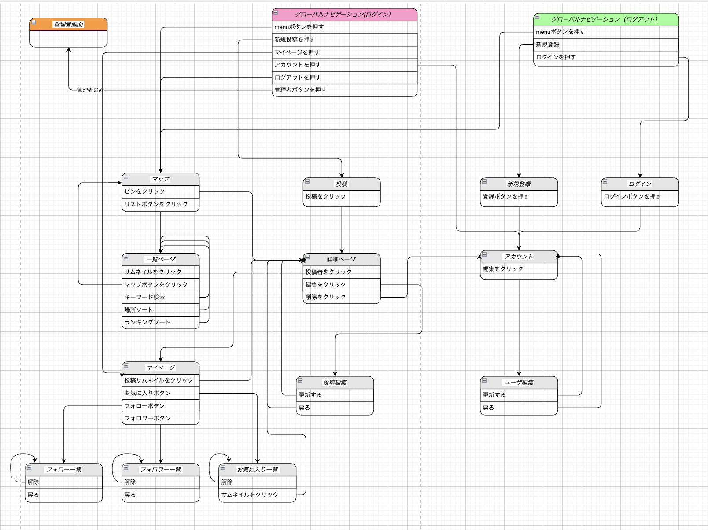

# README

## 開発言語
* Ruby 3.0.1
* Ruby on Rails 6.1.7

## カリキュラムの技術
* devise
* rails_admin
* お気に入り機能
* フォロー機能
* AWS EC2

## カリキュラム外の技術
* google maps API
* geocoder
* chart.js
* 天気予報系API導入予定
* 月の出、月没時間取得系API導入予定
* 周辺地域の情報を所得するAPI導入予定

## 実行手順
* git clone https://github.com/genergia/StarFinder.git
* cd StarFinder
* bundle install
* yarn add @babel/plugin-proposal-private-methods
* yarn add --dev @babel/plugin-proposal-private-property-in-object
* yarn install
* rails db:create && rails db:migrate
* rails s

## カタログ設計
https://docs.google.com/spreadsheets/d/1Sv1xPKt93eveZDH3BZty6n0g1dT3k1YsbuPGNN1aqKA/edit#gid=1186708815

## テーブル定義書
https://docs.google.com/spreadsheets/d/1Z3Jr6FGV1eMw2JdwksX11o-AnSnzXgWjmy8kGfKitPM/edit#gid=895554373

## ワイヤーフレーム
https://drive.google.com/file/d/1InZ6lxTkKvG7lB2JcGeTN2wcF0oJJXmc/view?usp=sharing

## ER図

## 画面遷移図

